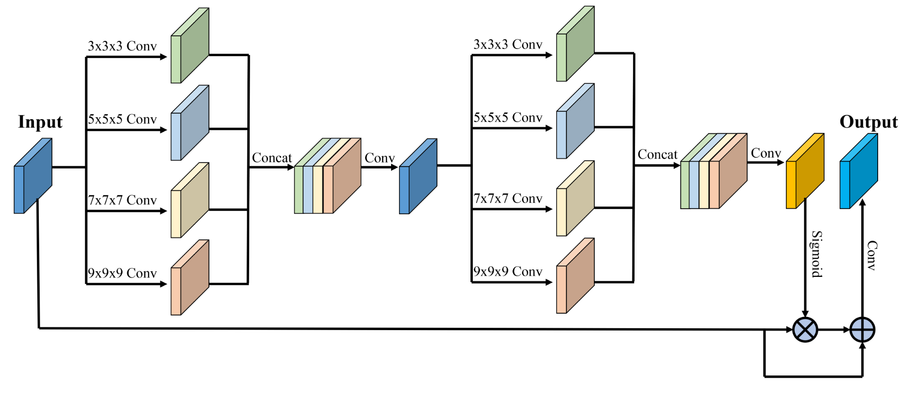
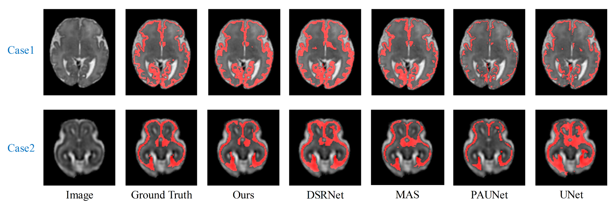
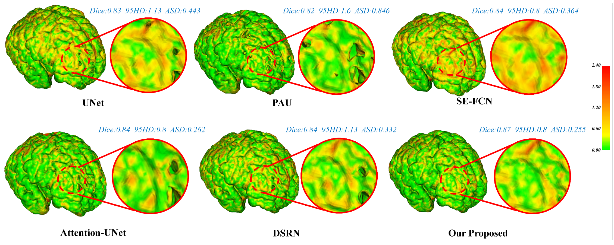

# Cortical Plate Segmentation in Fetal MRI. 
This repository is the implementation of the MixAttNet for cortical plate segmentation by Haoran Dou during his internship in Computational Radiology Lab at Boston Children's Hospital.

**A Deep Attentive Convolutional Neural Network for Automatic Cortical Plate Segmentation in Fetal MRI.**  
*Haoran Dou, Davood Karimi, Caitlin K. Rollins, Cynthia M. Ortinau, Lana Vasung, Clemente Velasco-Annis, Abdelhakim Ouaalam, Xin Yang, Dong Ni, and Ali Gholipour.*   
IEEE Transactions on Medical Imaging, 2021. [[Paper]](https://ieeexplore.ieee.org/document/9303459) [[arXiv]](https://arxiv.org/pdf/2004.12847.pdf)  

  

> Fetal cortical plate segmentation is essential in quantitative analysis of fetal brain maturation and cortical folding. Manual segmentation of the cortical plate, or manual refinement of automatic segmentations is tedious and time-consuming. Automatic segmentation of the cortical plate, on the other hand, is challenged by the relatively low resolution of the reconstructed fetal brain MRI scans compared to the thin structure of the cortical plate, partial voluming, and the wide range of variations in the morphology of the cortical plate as the brain matures during gestation. To reduce the burden of manual refinement of segmentations, we have developed a new and powerful deep learning segmentation method. Our method exploits new deep attentive modules with mixed kernel convolutions within a fully convolutional neural network architecture that utilizes deep supervision and residual connections. We evaluated our method quantitatively based on several performance measures and expert evaluations. Results show that our method outperforms several state-of-the-art deep models for segmentation, as well as a state-of-the-art multi-atlas segmentation technique. We achieved average Dice similarity coefficient of 0.87, average Hausdroff distance of 0.96mm, and average symmetric surface difference of 0.28mm on reconstructed fetal brain MRI scans of fetuses scanned in the gestational age range of 16 to 39 weeks. With a computation time of less than 1 minute per fetal brain, our method can facilitate and accelerate large-scale studies on normal and altered fetal brain cortical maturation and folding.

## Usage  
### Dependencies  
This work depends on the following libraries:  
Pytorch  
Nibabel  
Numpy  
[Volumentations](https://github.com/ashawkey/volumentations)  

### Train and Test
Run the following code to train the network  
```
python Train.py
```
Run the following code to test the network
```
python Infer.py
```
You can rewrite the DataOprate.py to train your own data.

## Result
Visual comparison of the segmentation results obtained from different methods.   
  
Visualization of the cortical surface error maps.  
  

## Relevant Resource
The relevant code can be also found at https://github.com/bchimagine  
If you have any question, please be free to contact Prof. Ali Gholipour (ali.gholipour@childrens.harvard.edu) or Mr. Haoran Dou (dhr9936@gmail.com).

## Citation  
If this work is helpful for you, please cite our paper as follows:   
```
@ARTICLE{9303459,
  author={H. {Dou} and D. {Karimi} and C. K. {Rollins} and C. M. {Ortinau} and L. {Vasung} and C. {Velasco-Annis} and A. {Ouaalam} and X. {Yang} and D. {Ni} and A. {Gholipour}},
  journal={IEEE Transactions on Medical Imaging}, 
  title={A Deep Attentive Convolutional Neural Network for Automatic Cortical Plate Segmentation in Fetal MRI}, 
  year={2021},
  volume={40},
  number={4},
  pages={1123-1133},
  doi={10.1109/TMI.2020.3046579}}
```
